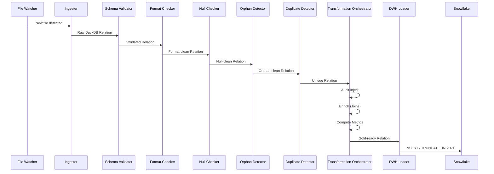
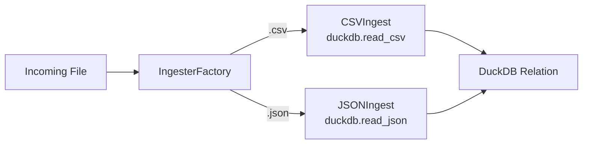
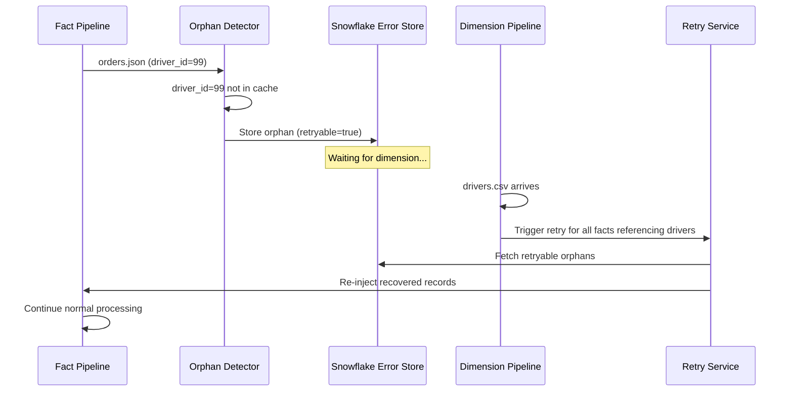
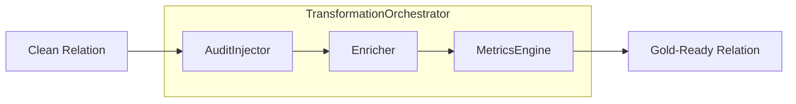
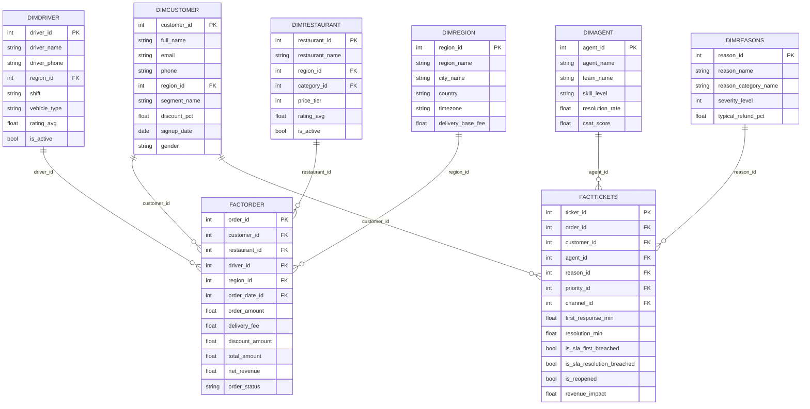

# Fast Feast Pipeline

A production-grade, near real-time data pipeline for a food delivery analytics platform. The system ingests heterogeneous data sources (CSV, JSON), enforces a multi-layer quality gate, applies business transformations, and loads enriched records into a Snowflake Gold Layer — all orchestrated through file-system watchers running on concurrent threads.

---

## Table of Contents

- [Architecture](#architecture)
- [Pipeline Flow](#pipeline-flow)
- [Project Structure](#project-structure)
- [Key Components](#key-components)
  - [Ingestion Layer](#ingestion-layer)
  - [Quality Gate](#quality-gate)
  - [Transformation Layer](#transformation-layer)
  - [Loading Layer](#loading-layer)
  - [Caching Layer](#caching-layer)
  - [Monitoring and Alerting](#monitoring-and-alerting)
- [Data Model](#data-model)
- [Core Analytics](#core-analytics)
- [Design Patterns](#design-patterns)
- [Technology Stack](#technology-stack)
- [Getting Started](#getting-started)
- [Configuration](#configuration)
- [License](#license)

---

## Architecture

The system operates two parallel pipelines — **Batch** and **Stream** — each triggered by a dedicated file-system watcher. Both pipelines share a common processing core backed by DuckDB as the in-memory SQL engine and Snowflake as the cloud data warehouse.


---

## Pipeline Flow

Each file passes through a deterministic sequence of stages. The pipeline guarantees that only validated, de-duplicated, and enriched records reach the Gold Layer.



---

## Project Structure

```
fast-feast-project/
|
|-- main.py                          # Application entry point
|-- requirements.txt                 # Python dependencies
|-- .env                             # Environment secrets (Snowflake, SMTP)
|
|-- config/
|   |-- config.yaml                  # Paths, rules, SLA thresholds
|   |-- config_loader.py             # YAML config parser
|   |-- schema.yaml                  # Table schemas (columns, types, formats)
|   |-- schema_loader.py             # Schema YAML parser
|   |-- required_cols.yaml           # Required (non-nullable) column definitions
|   |-- required_cols_loader.py      # Required columns parser
|   |-- format_pattern.py            # Regex patterns for format validation
|   |-- type_mapping.py              # YAML-to-DuckDB type mapping
|
|-- ingestion/
|   |-- base_ingester.py             # Abstract ingester interface
|   |-- csv_ingest.py                # CSV reader via DuckDB
|   |-- json_ingest.py               # JSON reader via DuckDB
|   |-- ingester_factory.py          # Factory pattern for reader selection
|
|-- watchers/
|   |-- base_watcher.py              # Abstract watcher + event handler
|   |-- batch_watcher.py             # Watches batch input directory
|   |-- stream_watcher.py            # Watches stream input directory
|
|-- pipelines/
|   |-- batch_pipeline.py            # Batch processing orchestration
|   |-- stream_pipeline.py           # Stream processing orchestration
|
|-- processing/
|   |-- schema_validator.py          # Orchestrates 3-step schema validation
|   |-- formats.py                   # Regex-based format validation
|   |-- error_batch_writer.py        # Writes bad records to Snowflake
|   |-- validators/
|   |   |-- filename_validator.py    # Validates filename against schema
|   |   |-- columns_validator.py     # Checks for missing/extra columns
|   |   |-- datatype_validator.py    # TRY_CAST-based type validation
|   |-- quality_chekers/
|   |   |-- null_checker.py          # Null detection and separation
|   |   |-- duplicate_detector.py    # Deduplication logic
|   |   |-- orphan_handling/
|   |       |-- orphan_detector.py   # FK integrity checks
|   |       |-- register_orphans.py  # Stores orphans in Snowflake
|   |       |-- retry.py             # Re-processes orphans on dim arrival
|   |       |-- fact_insertion.py    # Handles fact record re-insertion
|   |-- transformations/
|   |   |-- __init__.py              # TransformationOrchestrator (Facade)
|   |   |-- base.py                  # BaseTransformer abstract class
|   |   |-- audit_injector.py        # Adds ingested_at and batch_id
|   |   |-- enricher.py              # Dimension joins (denormalization)
|   |   |-- metrics_engine.py        # SLA, revenue, date key calculations
|   |-- monitoring/
|       |-- metrics_tracker.py       # Pipeline observability and metrics
|
|-- db/
|   |-- connections.py               # DuckDB + Snowflake singletons
|   |-- dwh_loader.py                # Generic Snowflake loader
|   |-- warehouse_manager.py         # Auto resume/suspend warehouse
|   |-- metadata_db.py               # File hash tracking (idempotency)
|   |-- RowSeparator.py              # TRY_CAST row separation logic
|
|-- caching/
|   |-- DimensionCache.py            # In-memory dimension cache via DuckDB
|
|-- core/
|   |-- logger.py                    # Rotating file + console logger
|   |-- alerter.py                   # Async email alerts via SMTP
|
|-- sql/
|   |-- analytical_queries.sql       # 10 core business KPI queries
|   |-- ddl/                         # Snowflake DDL scripts
|
|-- scripts/
|   |-- generate_master_data.py      # Synthetic dimension data generator
|   |-- generate_batch_data.py       # Synthetic batch file generator
|   |-- generate_stream_data.py      # Synthetic stream file generator
|   |-- simulate_day.py              # End-to-end day simulation
|   |-- add_new_customers.py         # Incremental customer generation
|   |-- add_new_drivers.py           # Incremental driver generation
|
|-- tests/
|   |-- test_db_conn.py              # Connection integration tests
|
|-- utils/
|   |-- utils.py                     # Shared utility functions
```

---

## Key Components

### Ingestion Layer

The ingestion layer uses the **Factory Pattern** to select the appropriate reader based on file extension. Both readers leverage DuckDB's native file-reading capabilities, which are significantly faster than equivalent Pandas operations for analytical workloads.



| Reader | Method | Output |
|--------|--------|--------|
| `CSVIngest` | `duckdb.read_csv()` | `DuckDBPyRelation` |
| `JSONIngest` | `duckdb.read_json()` | `DuckDBPyRelation` |

### Quality Gate

Every record passes through a five-layer validation pipeline. Each layer either forwards clean records to the next stage or quarantines failures to the Snowflake error store with full traceability.

| Layer | Component | Purpose | Quarantine Target |
|-------|-----------|---------|-------------------|
| 1 | `SchemaValidator` | Filename, columns, data types | Drop entire file |
| 2 | `FormatChecker` | Regex validation (email, phone, date) | Row-level to Snowflake |
| 3 | `NullChecker` | Required column enforcement | Row-level to Snowflake |
| 4 | `OrphanDetector` | Foreign key integrity against cached dims | Row-level with retry |
| 5 | `DuplicateDetector` | Deduplication (stream pipeline only) | Row-level discard |

**Orphan Retry Mechanism:**



### Transformation Layer

The transformation layer follows the **Facade Pattern** through `TransformationOrchestrator`, which coordinates three specialized transformers in sequence.



**AuditInjector** — Appends `ingested_at` (current timestamp) and `batch_id` (UUID) to every row for lineage tracking.

**Enricher** — Performs LEFT JOIN operations against cached dimension tables to denormalize records for the Gold Layer:

| Source Table | Joined With | Columns Added |
|-------------|-------------|---------------|
| `customers` | `segments` | `segment_name`, `discount_pct` |
| `regions` | `cities` | `city_name`, `country`, `timezone` |
| `agents` | `teams` | `team_name` |
| `reasons` | `reason_categories` | `reason_category_name` |
| `tickets` | `priorities`, `channels` | `sla_first_response_min`, `sla_resolution_min`, `channel_name` |

**MetricsEngine** — Computes business KPIs and date surrogate keys:

| Table | Computed Column | Formula |
|-------|----------------|---------|
| `tickets` | `first_response_min` | `(first_response_at - created_at) / 60` |
| `tickets` | `resolution_min` | `(resolved_at - created_at) / 60` |
| `tickets` | `is_sla_first_breached` | `first_response_min > sla_first_response_min` |
| `tickets` | `is_sla_resolution_breached` | `resolution_min > sla_resolution_min` |
| `tickets` | `is_reopened` | `status == 'Reopened'` |
| `tickets` | `revenue_impact` | `COALESCE(refund_amount, 0)` |
| `orders` | `net_revenue` | `order_amount + delivery_fee - discount_amount` |
| `orders` | `delivery_duration_min` | `(delivered_at - order_created_at) / 60` |
| both | `*_date_id` | `CAST(strftime(timestamp, '%Y%m%d') AS INTEGER)` |

### Loading Layer

The `DWHLoader` implements a strategy-based loading mechanism that distinguishes between dimension and fact tables:

| Table Type | Strategy | Behavior |
|-----------|----------|----------|
| Dimension (batch) | Truncate + Insert | Full overwrite on each batch |
| Fact (stream) | Append | Incremental insert |

The loader auto-creates tables in Snowflake if they do not exist, using inferred column types from the DataFrame schema.

`WarehouseManager` wraps all Snowflake operations in a context manager that automatically resumes a suspended warehouse before operations and suspends it afterward to minimize credit consumption.

### Caching Layer

`DimensionCache` registers dimension tables as named views in DuckDB after they pass validation. This enables the `Enricher` and `OrphanDetector` to perform SQL joins against in-memory dimension data without additional I/O.

### Monitoring and Alerting

- **MetricsTracker** — Records batch timing, row counts, success/failure rates, and persists summary metrics to Snowflake.
- **AuditLogger** — Rotating file logger with console output. Separate log files for general events and errors.
- **Alert** — Asynchronous email notifications via SMTP (Gmail) on critical pipeline failures. Runs on a background thread to avoid blocking the pipeline.

---

## Data Model

The Snowflake Gold Layer implements a star schema optimized for analytical queries.



---

## Core Analytics

The following KPI queries are available in `sql/analytical_queries.sql` and can be executed against either DuckDB (local) or Snowflake (production):

| Metric | Description |
|--------|-------------|
| Total Tickets | Aggregate ticket count |
| SLA Breach Rate | Percentage of tickets exceeding first-response or resolution SLA |
| Avg Resolution Time | Mean time from ticket creation to resolution (minutes) |
| Avg First Response Time | Mean time from ticket creation to first agent response (minutes) |
| Reopen Rate | Percentage of tickets with status "Reopened" |
| Refund Amount | Total monetary value of refunds issued |
| Revenue Impact | Aggregate financial loss from customer complaints |
| Tickets by City/Region | Geographic distribution of support tickets |
| Tickets by Restaurant | Restaurant-level complaint frequency |
| Tickets by Driver | Driver-level issue tracking |
| Complaint Rate | Number of tickets per 1,000 orders |
| Revenue Loss by Category | Financial impact grouped by complaint reason |

---

## Design Patterns

| Pattern | Implementation | Purpose |
|---------|---------------|---------|
| **Factory** | `IngesterFactory` | Selects CSV or JSON reader based on file extension |
| **Facade** | `TransformationOrchestrator` | Single entry point for multi-step transformations |
| **Singleton** | `DuckDBConnection`, `SnowflakeConnection` | Thread-safe shared database connections |
| **Strategy** | `DWHLoader` | Switches between truncate+insert and append based on table type |
| **Abstract Base Class** | `BaseTransformer`, `FileWatcher`, `Ingester` | Enforces consistent interfaces across implementations |
| **Observer** | `Watchdog EventHandler` | File-system event detection triggers pipeline execution |

---

## Technology Stack

| Component | Technology | Justification |
|-----------|-----------|---------------|
| Language | Python 3.x | Ecosystem maturity for data engineering |
| Processing Engine | DuckDB | In-process OLAP with native SQL, columnar storage, and lazy evaluation. 10-100x faster than Pandas for analytical workloads |
| Data Warehouse | Snowflake | Elastic cloud DWH with separation of compute and storage |
| File Monitoring | Watchdog | Cross-platform filesystem event detection |
| Configuration | YAML | Schema-driven validation without code changes |
| Alerting | SMTP (Gmail) | Asynchronous email notifications on failures |
| Logging | Python `logging` | Rotating file handlers with structured output |

---

## Getting Started

### Prerequisites

- Python 3.9+
- Snowflake account with `ACCOUNTADMIN` role
- Gmail account with App Password (for alerting)

### Installation

```bash
git clone https://github.com/your-username/fast-feast-project.git
cd fast-feast-project

python -m venv venv
venv\Scripts\activate        # Windows
# source venv/bin/activate   # Linux/macOS

pip install -r requirements.txt
```

### Environment Setup

Create a `.env` file in the project root:

```env
SNOWFLAKE_ACCOUNT=your_account
SNOWFLAKE_USER=your_user
SNOWFLAKE_PASSWORD=your_password
SNOWFLAKE_ROLE=ACCOUNTADMIN
SNOWFLAKE_WAREHOUSE=COMPUTE_WH
SNOWFLAKE_DATABASE=FASTFEASTDWH
SENDER_EMAIL=your_email@gmail.com
EMAIL_PASSWORD=your_app_password
ADMIN_EMAIL=admin@example.com
```

### Generate Sample Data

```bash
python scripts/generate_master_data.py
python scripts/generate_batch_data.py
python scripts/generate_stream_data.py
```

### Run the Pipeline

```bash
python main.py
```

The pipeline starts two concurrent watchers. Drop CSV files into `data/input/batch/` and JSON files into `data/input/stream/` to trigger processing.

---

## Configuration

All pipeline behavior is driven by YAML configuration files in the `config/` directory:

- **`config.yaml`** — File paths, SLA thresholds, retry limits, supported formats
- **`schema.yaml`** — Per-table column definitions including names, types, formats, and primary keys
- **`required_cols.yaml`** — Columns that must not contain null values

Schema changes require no code modifications — update the YAML files and the pipeline adapts automatically.

---

## License

This project was developed as part of the ITI - Data Management track.
